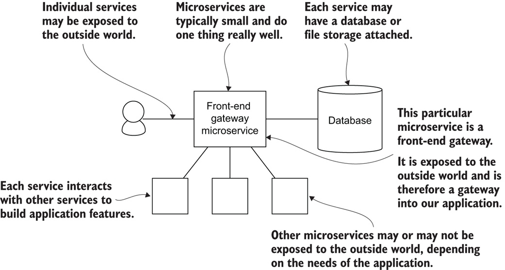

# Microservices

## What is a Microservice?

A **microservice**, also known as a **microservice architecture**, is a way of building software applications as a collection of **small, independent services** that work together. These services are:

* **Independently deployable:** Each service can be deployed and updated separately without affecting other parts of the application.
* **Loosely coupled:** Services communicate with each other through well-defined APIs, minimizing dependencies and making them easier to maintain and modify.
* **Focused on specific functionality:** Each service performs a single, well-defined task, promoting modularity and reusability.

Here's an analogy to help understand microservices: Imagine building a car. Traditionally, you might build the entire car as one unit, with the engine, transmission, and wheels all tightly coupled. This is similar to a **monolithic architecture** in software development.

With microservices, you would instead build the car as a collection of independent modules:

* **Engine service:** Responsible for starting, stopping, and controlling the engine.
* **Transmission service:** Handles gear changes and power transfer.
* **Wheel service:** Controls the movement and direction of each wheel.

These modules would communicate with each other through well-defined interfaces, allowing them to be developed, tested, and deployed independently.

**Benefits of using microservices:**

* **Increased agility and faster development:** Easier to make changes and deploy new features.
* **Improved scalability and fault tolerance:** Individual services can be scaled independently and failures are contained within specific services.
* **Enhanced maintainability and flexibility:** Easier to understand, modify, and update individual services.

**However, microservices also come with challenges:**

* **Increased complexity:** Managing distributed systems can be more complex than monolithic applications.
* **Potential for higher operational overhead:** Requires additional effort to monitor, log, and troubleshoot issues across multiple services.
* **Need for robust communication and API management:** Efficient communication and API design are crucial for successful implementation.

Overall, microservices offer a powerful approach for building modern, scalable, and maintainable software applications.

## Microservice Accessibility and Persistence

**Microservices can be categorized based on their accessibility and data persistence:**

**1. Public Microservice:**

* **Description:** Exposed to the external world, allowing customers or other applications to interact with it directly.
* **Example:** An e-commerce platform's "Product Search" service.

**2. Internal Microservice:**

* **Description:** Not directly accessible from outside the system, used for internal communication and functionalities.
* **Example:** An e-commerce platform's "Order Processing" service.

**3. Hybrid Microservice:**

* **Description:** May have both public and internal functionalities, with specific endpoints exposed externally.
* **Example:** An e-commerce platform's "User Management" service offering public login/registration and internal account management APIs.

**Data Persistence:**

**Microservices typically have access to some form of data persistence:**
**Database:** Most common, storing structured data in relational or NoSQL databases.
**File Storage:** Used for storing unstructured data like images, documents, etc.
**Cache:** Temporary storage for frequently accessed data to improve performance.

